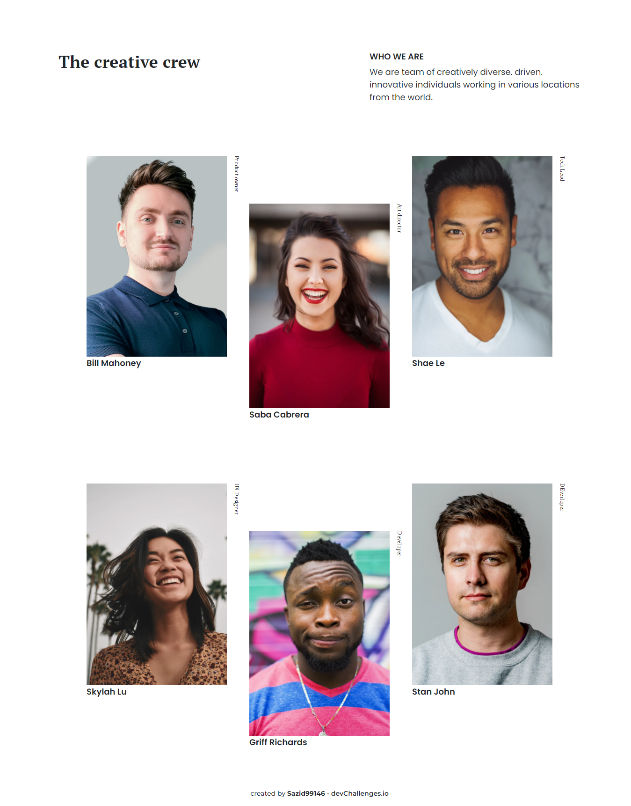

<!-- Please update value in the {}  -->

<h1 align="center">My Team Page</h1>

   Solution for a challenge from  <a href="http://devchallenges.io" target="_blank">Devchallenges.io</a>.

  <h3>
    <a href="https://sazid99246.github.io/my-team-page/">
      Demo
    </a>
     | 
    <a href="https://github.com/Sazid99246/my-team-page">
      Solution
    </a>
     | 
    <a href="https://devchallenges.io/challenges/hhmesazsqgKXrTkYkt0U">
      Challenge
    </a>
  </h3>

<!-- TABLE OF CONTENTS -->

## Table of Contents

- [Overview](#overview)
  - [Built With](#built-with)
- [Features](#features)
- [Contact](#contact)
- [Acknowledgements](#acknowledgements)

<!-- OVERVIEW -->

## Overview

Introduce your projects by taking a screenshot or a gif. Try to tell visitors a story about your project by answering:

- Where can I see your demo?
Ans: My Site demo: https://sazid99246.github.io/my-team-page/

- What was your experience?
Ans: My experience is awesome. I have learned many and many things to develop this site

- What have you learned/improved?
Ans: I have learned CSS Writing Mode Property, CSS Flexbox, Bootstrap Grid Layout and many more.

- Your wisdom? :)
Ans: I wish I would make many more websites and learn through them.

### Built With

<!-- This section should list any major frameworks that you built your project using. Here are a few examples.-->

- [Bootstrap](https://getbootstrap.com/)

## Features

<!-- List the features of your application or follow the template. Don't share the figma file here :) -->

This application/site was created as a submission to a [DevChallenges](https://devchallenges.io/challenges) challenge. The [challenge](https://devchallenges.io/challenges/hhmesazsqgKXrTkYkt0U) was to build an application to complete the given user stories.

## Acknowledgements

<!-- This section should list any articles or add-ons/plugins that helps you to complete the project. This is optional but it will help you in the future. For exmpale -->
- [Bootstrap Grid](https://getbootstrap.com/docs/5.1/layout/grid/)
- [Bootstrap Gutters](https://getbootstrap.com/docs/5.1/layout/gutters/)
- [CSS Text Orientation](https://developer.mozilla.org/en-US/docs/Web/CSS/text-orientation)
- [CSS Position Property](https://www.w3schools.com/css/css_positioning.asp)

## Contact

- GitHub [@Sazid99246](https://github.com/Sazid99246)